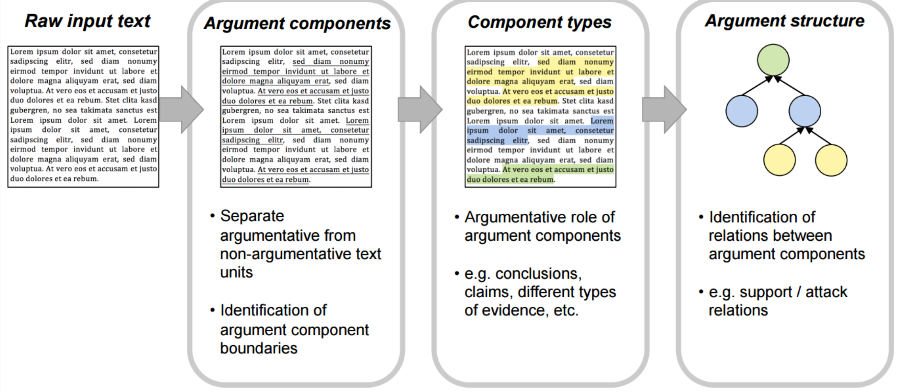

## Goal

<figure>
    
    <figcaption align = "center">
        <b>Desires pipeline</b>
    </figcaption>
</figure>

## Corpora

400 annotated student essays

## Test set evaluation


### CI_CC


| Name     | f1_I-Claim | f1_B-Claim | f1_I-Premise | f1_B-Premise | f1_O |
| ---      | ---       | --- | --- |  --- | --- |
| bert | 0.07 | 0.08 | 0.77 | 0.31 |  0.82 | 

Reproduce:
```
python lightning_driver.py test \ 
    --config ./lightning_logs/CI_CC/version_4/config.yaml 
    --ckpt_path ./lightning_logs/CI_CC/version_4/checkpoints/epoch=242-val_loss=0.89.ckpt
```

Analysis: CI performance is more or less okay. Classifying components fails.

### RI_RC

| Name     | f1_attacks | f1_supports | f1_unrelated |
| ---      | ---       | --- | --- |
| bert + shared + extra features | 0.00 | 0.65 | 0.68 |

```
python lightning_driver.py test \
    --config ./lightning_logs/RI_RC/extra_shared__bertCls_baseHead/version_5/config.yaml \ 
    --ckpt_path ./lightning_logs/RI_RC/extra_shared__bertCls_baseHead/version_5/checkpoints/epoch=27-val_loss=0.72.ckpt
```


## Training logs

```
tensorboard --logdir ./lightning_logs
```

## Infrastructure

LightningCLI